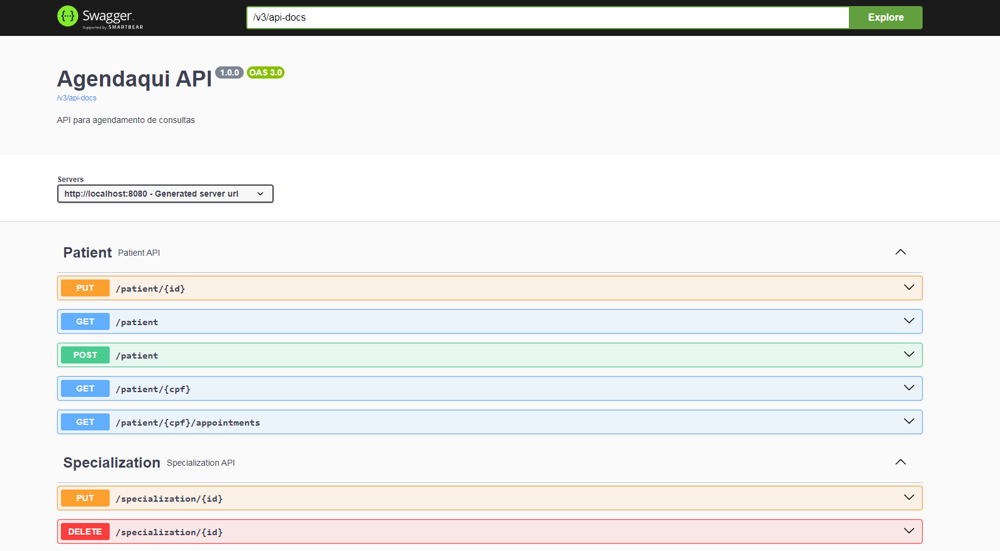

# AgendAqui

<p align="center"></p>

API para agendamento de consultas clínicas desenvolvida como trabalho da faculdade do curso de sistemas de informação.

Com esta API é possível definir especialidades com seus respectivos horários de atendimento, cadastrar pacientes, agendar e verificar consultas.

Para os agendamentos, temos a validação de horários e conflito de agenda, mostramos também a informação dos dias e horários que já estão bloqueados.

## Rodando o projeto

Instale as dependências do projeto pulando os testes

```bash
$ mvn install -DskipTests
```
Configure o arquivo `application.yaml` com os dados corretos do banco de dados Postgres.

Caso você utilize Docker e não deseje instalar o Postgres, pode deixar o arquivo `application.yaml` como está e rodar o comando `docker-compose up -d` para inicializar o Postgres.

Se desejar, pode rodar os testes com o comando

```bash
$ mvn test
```

Rode o projeto com o comando
```bash
$ mvn spring-boot:run
```

Acesse as especificações da API no endpoint [http://localhost:8080/swagger-ui.html](http://localhost:8080/swagger-ui.html)


